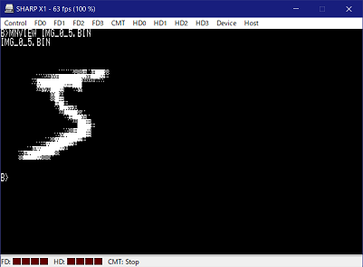
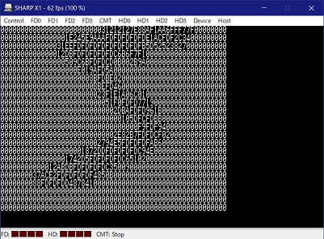
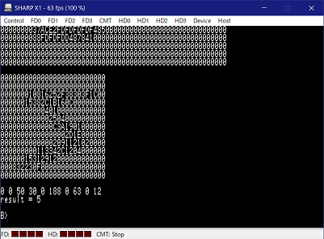

# Convolutional Neural Network for digits recognition on CP/M-80

2022-09-25 programmed by Meister

## 概要

ニューラルネットワークによる手書き文字認識をCP/M-80(および互換性のある[LSX-Dodgers](https://github.com/tablacus/LSX-Dodgers)とMSX-DOS)に実装しました。
28×28ピクセルの数字(0～9)の種別を認識することができます。

## 実行方法

GitHubに学習済みネットワークとサンプルデータの入ったディスクイメージを公開していますので，これをX1エミュレータもしくはMSXエミュレータで使用するのがお手軽です。X1エミュレータとLSX-Dosgersを使用する場合の環境構築に関しては[X1エミュレータ環境を整える](https://note.com/medamap/n/n4146227b2f9e#f48345ad-3176-4102-9af4-d9866683de98)を参考にしてください。

ディスクイメージ中のMNIST.COMが実行ファイル，MNMODEL.BINが[MNIST](http://yann.lecun.com/exdb/mnist/)のデータセットで学習したネットワークの重みデータです。
MNMODEL.BINはカレントドライブ(階層化ディレクトリの使えるOSではカレントディレクトリ)に置く必要があります。

```
MNIST.COM [画像ファイル名]
```

### 画像ファイルのフォーマット

28×28ピクセル256階調のグレースケール画像で，全784byteの無圧縮・ヘッダなしバイナリファイルです。具体的には下記のフォーマットとなります。

```
[ピクセルの階調 1byte][ピクセルの階調 1byte]...[ピクセルの階調 1byte] ← 1ライン目 28byte
[ピクセルの階調 1byte][ピクセルの階調 1byte]...[ピクセルの階調 1byte] ← 2ライン目 28byte
     ・
     ・
     ・
[ピクセルの階調 1byte][ピクセルの階調 1byte]...[ピクセルの階調 1byte] ← 28ライン目 28byte
```

model_training/make_mnist_beta.rb を使用するとMNISTデータセット(train-images-idx3-ubyteとtrain-labels-idx1-ubyte)からバイナリ形式で画像を抜き出します。

### 画像ファイルのビューワ

前節のフォーマットの画像ファイルをディザリングして表示するLSX-Dodgers用(ワークエリアを直接アクセスする関係でversion 1.40限定)のプログラムを付属しています。8×4ドットで16階調の2ピクセルを表現しますが，2ピクセル分を組み合わせた8x8ドットをPCGとして定義し，テキスト14行を使用して28ラインの画像を表示します。

```
SETPCG.COM DITHER.PCG
MNVIEW.COM IMG_0_5.BIN
```

SETPCG.COMのソースは https://github.com/meister68k/setpcg_X1 にあります。

### 実行例

  
対象画像のプレビュー。  

  
第1層(畳み込み層)の実行中。ここで少し時間がかかります。

  
アスキーアート風に数値が並んでいるのが13×13となった第1層の出力結果です。
その下に数値が10個ならんでいるのが最終層の出力結果で，左から順に数字0～9の確度となります。この場合は数字5が188で最も可能性が高く，数字7が63で時点となっています。

最終行が認識結果を表しており，「result = 5」つまり数字の5であると正しく認識できました。
認識率90%程度だと思います。

## 技術的な詳細

### 基本戦略

MNIST手書き数字データセットで学習したネットワークを量子化し，固定小数点で演算します。

8bit CPUで実行可能なサイズに収めるためネットワークパラメータ数をなるべく減らし，演算を8～16bitで済ませることが重要です。

### ネットワークの構造

ネットワーク構成を下の表に示します。入力層，畳み込み層，全結合層の3層ニューラルネットワークです。畳み込み層のカーネルサイズは3×3×8です。

| Layer       | Output Shape | Param # | Activation    |
|:------------|:-------------|--------:|:--------------|
| Input       | (28, 28)     | 0       | none          |
| Conv2D      | (13, 13, 8)  | 80      | ReLU          |
| FullConnect | (10)         | 13520   | ReLU(Softmax) |

パラメータの総数が13600個となっており，1パラメータを1バイトで表現するため13KByte強のデータ量となります。

パラメータ数を減らすための工夫として，畳み込み層のストライドを2として入力画像を約1/2にリサイズしています。また全結合層のバイアスを省略しています。

全結合層の活性化関数は学習時のみSoftmaxを使用し，CP/M上での推論時にはReLUとしました。

### 学習

Google Colabを使用してPython+TensorFlowで学習用ネットワークを実装し，重みをJSON形式で出力します。10エポックで学習を終了しました。

model_training/MNIST_minimum.ipynb が学習用ネットワークのソースです。
学習したネットワークの重みをjson形式で出力します。

### 量子化

倍精度実数形式で学習したネットワークの重みを符号 1bit，整数部 2bit精度，小数部 5bit精度の8bit 固定小数点形式に量子化しています。畳み込み層の出力も小数部 5bit精度ですが，符号なしのため整数部 3bit精度となっています。レイヤー内の演算はオーバーフローを防ぐため16bitとしています。

入力画像は0～255の値で，これが0.0～1.0の明度に相当します。そのため入力値を1/255する処理が必要になりますが，これを高速化のために1/256で置き換えるため，畳み込み層の重みを事前に256/255倍しています。

| Layer           | Sign | Integer | Fraction |
|:----------------|-----:|--------:|---------:|
| Input           | 0    | 0       | 8bit     |
| Conv2D (weight) | 1bit | 2bit    | 5bit     |
| Conv2D (output) | 0    | 3bit    | 5bit     |
| F.C. (weight)   | 1bit | 2bit    | 5bit     |
| F.C. (output)   | 0    | 3bit    | 5bit     |

model_training/NNSS-V_MNIST.rb でjson形式の重みを読み込んで量子化し，再びjson形式で出力します。

### 重みのバイナリフォーマット

量子化した重みをバイナリファイルに格納しています。特にヘッダなどなく8bit整数をべたに並べただけのファイルです。オフセット値を以下の表に示します。

| Offset | Contain       | Shape      |
|-------:|:-------------:|:-----------|
| 0      | Conv2D bias   | [8]        |
| 8      | Conv2D kernel | [3][3][8]  |
| 80     | F.C. kernel   | [1352][10] |

model_training/make_weights.rb で量子化済みのjson形式の重みを読込み，バイナリフォーマットで出力します。出力されたバイナリファイルをCP/M上で使用します。

### 使用コンパイラ

[z88dk](https://z88dk.org)を使用しました。
C99で拡張されたブロック途中の変数宣言や一行コメント(//)，stdint.hが使用可能です。しかし多次元配列の型宣言が可能であるものの実際のアクセス動作が怪しかったため1次元配列に変換してアクセスしています。

```C
void example(uint8_t hoge[][SIZE], int x, int y)
{
    uint8_t a = hoge[y][x];             // NG?
    uint8_t b = hoge[0][y * SIZE + x];  // OK
}
```

添え字範囲をチェックしないからこそできる技ですね。

### 開発時の実行環境(CP/Mエミュレータ)

開発には[CP/M Player for Win32](http://takeda-toshiya.my.coocan.jp/cpm/index.html)を使用し，8bit機で動作可能であることの確認には[Common Source Code Project](http://takeda-toshiya.my.coocan.jp/)のX1エミュレータ eX1とLSX-Dodgers version1.23の改造版(SP周りの改造，本家1.40に反映済み)，およびCP/M V2.2 (シャープ型番 ランゲージマスター CZ-128SF)を使用しました。

## 終わりに

私が初めてニューラルネットワークの実装をしたのは1991年の夏だったと思います。最初はX1用のHu-BASIC，遅くて話にならなかったためすぐにαFORTRANで書き直しましたが，どちらもうまく学習させることができませんでした。ようやく30年来の宿題にけりを付けられたことになります。

## 参考文献

1. ニューロコンピュータへの挑戦, 塩野 悟, アグネ承風社, 1990, ISBN 4-900508-03-9
2. 入門ニューロコンピュータ, 菊池豊彦, オーム社, 1990, ISBN 4-274-07547-8

## ライセンス

sampleフォルダ内を除く本プログラム\(ソース・バイナリ含む\)およびドキュメント一式について，CC0ライセンス
\( http://creativecommons.org/publicdomain/zero/1.0/deed.ja \)を宣言します。

ただしsampleフォルダ内のファイルはYann LeCun, Corinna Cortes, Christopher J.C. BurgesらによるTHE MNIST DATABASE of handwritten digits \( http://yann.lecun.com/exdb/mnist/ \)から抜粋したものであり，慣例から恐らく自由に利用できるもののライセンスは明記されていません。
